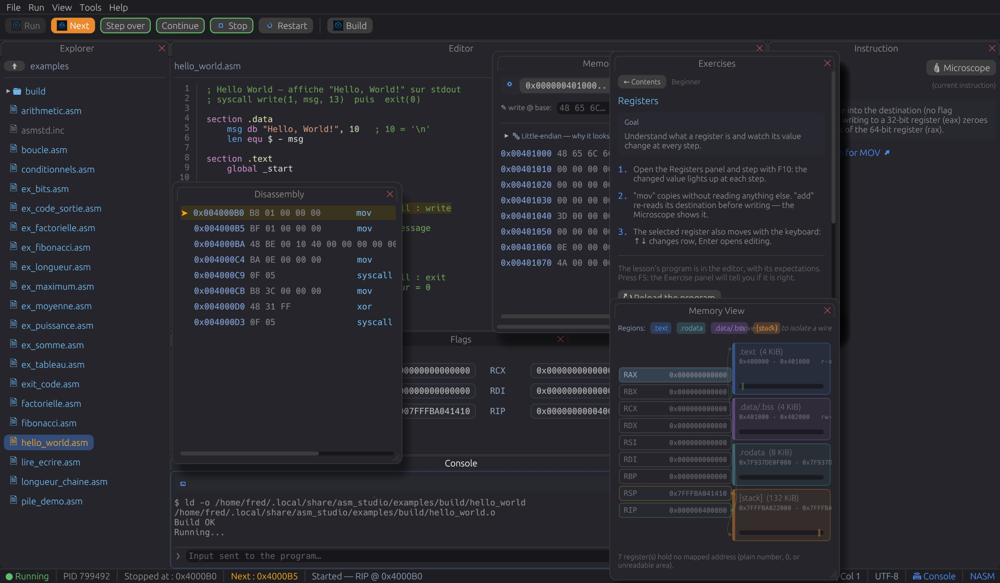

# ASM Studio

[English](README.md) | [Français](README.fr.md) | **Español**

> IDE pedagógico para aprender ensamblador **NASM x86-64** en Linux.

ASM Studio no es un simulador: su programa se **ensambla realmente**
(`nasm`), se **enlaza** (`ld`) y lo **ejecuta el núcleo Linux de verdad**,
dirigido paso a paso mediante `ptrace`. Lo que usted ve — registros,
banderas, pila, memoria — es el estado auténtico del proceso, no una
aproximación.



---

## Contenido

- [Características](#características)
- [Instalación](#instalación)
- [Primeros pasos](#primeros-pasos)
- [Atajos de teclado](#atajos-de-teclado)
- [Compilar desde las fuentes](#compilar-desde-las-fuentes)
- [Dependencias](#dependencias)
- [Estructura del proyecto](#estructura-del-proyecto)
- [Licencia](#licencia)

---

## Características

- **Depurador real** — ejecución paso a paso de un binario NASM mediante
  `ptrace` (registros, `SETREGS`, lectura/escritura de `/proc/pid/mem`), no
  una máquina virtual simulada.
- **Puntos de interrupción, condicionales si hace falta** — un clic en el
  margen (o `Ctrl+F8`) marca una línea, y `Continuar` (`F9`) llega hasta ella
  de una vez. Un clic derecho (o `Ctrl+Mayús+F8`) le añade una condición —
  `RCX == 0`, `RAX > 0x100`, `ZF == 1` — y la ejecución solo se detiene si se
  cumple: así se llega a la vuelta cuatro mil de un bucle sin cuatro mil
  «Continuar». `Paso por encima` (`Mayús+F10`) ejecuta una `call` entera de
  golpe. Cada instrucción sigue entrando en la línea de tiempo.
- **Inspección al pasar el cursor** — pasar el ratón por una palabra del código
  muestra cuánto vale en ese instante: un registro en hexadecimal, en decimal,
  con signo, como carácter y con los bytes a los que apunta; un flag con su
  estado; una etiqueta con su línea y su dirección; un número en las tres bases.
- **Consola de verdad** — lo que el programa escribe en su salida estándar
  llega al IDE, y usted puede enviarle entrada: un programa detenido en un
  `read` le espera en lugar de congelar la interfaz.
- **Dos modos de visualización** — *Aprendizaje* (lo esencial: código,
  instrucción explicada, registros generales, pila, consola) y *Completo*
  (todo: desensamblado, vista de memoria, volcado hexadecimal, pila de
  llamadas, llamadas al sistema).
- **Disposición acoplable** — cada panel se arrastra, se apila o se desprende
  en una ventana flotante (`egui_dock`), como en un IDE clásico.
- **Recorrido guiado** — un tutorial de cinco niveles (Principiante,
  Intermedio, Avanzado, Experto y Windows/PE64) que introduce progresivamente
  registros, tamaños, memoria, banderas, pila y llamadas al sistema. Cada
  lección carga su programa, abre los paneles que explica y propone los
  ejercicios que la practican.
- **Ejercicios autocorregidos** — treinta y seis ejercicios con verificación
  automática del resultado, cada uno enlazado con la lección que lo explica.
- **Modo «CPU viva»** — animación de los registros y banderas modificados en
  cada paso, con distintivos de actividad PUSH/POP sobre la pila.
- **Predicción** — adivine el efecto de la próxima instrucción antes de
  ejecutarla, para afianzar la comprensión.
- **Registros SSE / x87** — los dieciséis registros XMM y la pila x87, leídos
  como los lee la instrucción: dos `double`, cuatro `float`, cuatro enteros de
  32 bits, dieciséis bytes o el hexadecimal en bruto. Con el modo de redondeo
  de MXCSR y las excepciones levantadas. Escribir `addsd xmm0, xmm1` y leer `5`
  ya no exige un acto de fe.
- **Destino Windows (PE64)** — el mismo código fuente se ensambla como un `.exe`
  de Windows real (`nasm -f win64` y un enlazador integrado: sin `lld-link` ni
  SDK de Microsoft). Un `extern ExitProcess` se convierte en una auténtica
  tabla de importación. El binario se desensambla, se abre en el panel FORMATO
  y, si `wine` está instalado, «Ejecutar» lo ejecuta de verdad: su salida llega
  a la consola habitual. Lo que queda fuera de alcance es el paso a paso: el
  depurador habla `ptrace` y sigue las direcciones de la imagen que acaba de
  escribir, que el cargador de Wine no conserva.
- **Explorador de formato binario** — encabezado, secciones, permisos, punto de
  entrada, importaciones y símbolos globales, presentados igual para ELF y para
  PE. Lo que cuesta una sección en memoria y en disco, y por qué `.bss` no pesa
  nada.
- **Calculadora integrada** — hexadecimal por defecto, vista bit a bit,
  operaciones habituales.
- **Diagnóstico de errores** — los mensajes de `nasm`/`ld` y los fallos en
  ejecución se reformulan en lenguaje claro.
- **Multilingüe** — interfaz en francés, inglés y español.
- **Actualización automática** — comprobación de nuevas versiones mediante
  GitHub Releases.

---

## Instalación

### Binario precompilado

Descargue el último archivo desde las
[Releases de GitHub](https://github.com/fredza/asm-studio/releases), y luego:

```bash
tar xzf asm-studio-*-linux-x86_64.tar.gz
cd asm-studio-*/
./install.sh                  # instalación de usuario, en ~/.local
# o bien
sudo ./install.sh --system    # instalación de sistema, en /usr/local
```

El script instala el binario, el icono y el archivo `.desktop`, y comprueba
que `nasm` y `ld` estén presentes.

### Véase también

- [`DEPENDENCIES.md`](DEPENDENCIES.md) — lista completa de las bibliotecas de
  sistema necesarias (Wayland/X11, portal XDG, `nasm`, `binutils`…) y los
  comandos de instalación por distribución.
- [`doc/GUIDE-DEMARRAGE-RAPIDE.md`](doc/GUIDE-DEMARRAGE-RAPIDE.md) — guía de
  uso completa (por ahora solo en francés): primer programa, paneles, atajos,
  resolución de problemas.

---

## Primeros pasos

En el primer arranque, ASM Studio crea sus carpetas de trabajo, las siembra
con ejemplos y ejercicios comentados, y abre en **modo Aprendizaje** con un
cartel que propone empezar el tutorial guiado.

Un primer programa mínimo (`Archivo → Nuevo`, `Ctrl+N`):

```nasm
section .text
    global _start
_start:
    mov rax, 60      ; sys_exit
    xor rdi, rdi     ; código de salida 0
    syscall
```

Ciclo de trabajo: **Ensamblar → Ejecutar → Paso a paso → Línea de tiempo**.
Todos los detalles en la
[guía de inicio rápido](doc/GUIDE-DEMARRAGE-RAPIDE.md) (en francés).

---

## Atajos de teclado

Los principales; `F1` muestra la lista completa dentro de la aplicación.

| Tecla | Acción |
|---|---|
| `F1` | Mostrar / ocultar la ayuda de atajos |
| `Ctrl+B` | Ensamblar y enlazar |
| `F5` | Ejecutar / reiniciar |
| `F10` (o `F8`) | Instrucción siguiente |
| `Mayús+F10` | Paso por encima: ejecuta la llamada de una vez |
| `F9` | Continuar hasta el próximo punto de interrupción |
| `Ctrl+F8` | Punto de interrupción en la línea del cursor (o clic en el margen) |
| `Ctrl+Mayús+F8` | Condición del punto de interrupción (o clic derecho en el margen) |
| `Esc` (o `Mayús+F5`) | Detener el programa |
| `←` / `→` | Línea de tiempo: paso anterior / siguiente |
| `Inicio` / `Fin` | Línea de tiempo: inicio / fin |
| `Ctrl+N` / `Ctrl+O` / `Ctrl+S` | Nuevo / Abrir / Guardar |
| `Ctrl+F` / `Ctrl+H` | Buscar / buscar y reemplazar |
| `Ctrl+Mayús+P` | Paleta de comandos — toda la aplicación desde el teclado |
| `Ctrl+1` … `Ctrl+5` | Mostrar / ocultar un panel |
| `F6` / `Mayús+F6` | Panel siguiente / anterior |

Toda la interfaz se maneja con el teclado: la paleta de comandos
(`Ctrl+Mayús+P`) alcanza cualquier acción sin pasar por los menús.

---

## Compilar desde las fuentes

Requisitos: Rust (edición 2024), `nasm`, `binutils` (`ld`) y las bibliotecas
listadas en [`DEPENDENCIES.md`](DEPENDENCIES.md) (Wayland/EGL, `libxkbcommon`,
portal XDG).

```bash
git clone https://github.com/fredza/asm-studio.git
cd asm-studio
cargo build --release
./target/release/asm_studio
```

Generar un archivo de distribución (binario + recursos + scripts):

```bash
./install/package.sh
# → dist/asm-studio-<versión>-linux-x86_64.tar.gz
```

Ejecutar las pruebas:

```bash
cargo test
```

---

## Dependencias

Plataforma: **Linux x86-64** únicamente (la ejecución paso a paso se apoya en
`ptrace`). Principales dependencias Rust:

| Crate | Función |
|---|---|
| `eframe` / `egui_dock` | interfaz gráfica y disposición acoplable |
| `nix` | `ptrace`, gestión de procesos y señales |
| `capstone` | desensamblado x86-64 |
| `object` | lectura de ELF/PE y escritura del ejecutable PE |
| `rfd` | diálogos de archivo nativos (portal XDG) |
| `ureq` / `serde` | comprobación de actualizaciones (GitHub Releases) |

Herramientas externas necesarias en ejecución: `nasm` (ensamblador) y `ld`
(enlazador). Véase [`DEPENDENCIES.md`](DEPENDENCIES.md) para el detalle
completo (bibliotecas de sistema, paquetes por distribución, comprobación
rápida).

---

## Estructura del proyecto

```
src/
├── app/            interfaz (paneles acoplables, menús, atajos, tutorial…)
├── debugger.rs      control por ptrace del proceso depurado
├── disasm.rs         desensamblado (capstone)
├── assemble.rs       invocación de nasm / ld (ELF) o nasm / enlazador integrado (PE)
├── pe_link.rs         enlazador PE64: secciones, importaciones, reubicaciones
├── binfmt.rs           explorador de formato binario (ELF y PE)
├── simd.rs              lectura de los registros XMM / x87
├── winerun.rs            ejecución del .exe producido, con Wine
├── tutorial.rs        contenido del recorrido guiado
├── exercise.rs         ejercicios autocorregidos
├── i18n.rs              traducciones FR / EN / ES
└── main.rs                punto de entrada
examples_seed/      ejemplos y ejercicios sembrados en el primer arranque
install/            scripts de instalación y empaquetado
doc/                guía de inicio rápido
```

---

## Licencia

Distribuido bajo la **ASM Studio Personal Free License (ASFL) v1.0** — véase
[`LICENSE.md`](LICENSE.md). En resumen: uso libre y gratuito, código fuente
consultable y modificable, contribuciones por *pull request* bienvenidas; la
venta o la redistribución comercial del software (original o modificado) está
prohibida sin autorización escrita del autor.

Copyright © 2026 Frédéric Zawalski.
