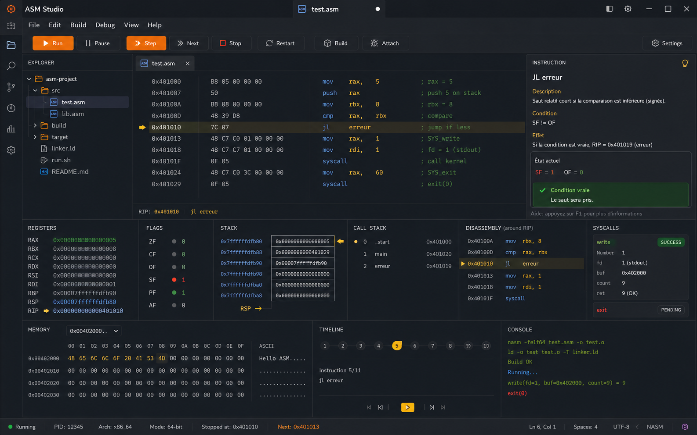

# ASM Studio

[English](README.md) | **Français**

> IDE pédagogique pour apprendre l'assembleur **NASM x86-64** sous Linux.

ASM Studio n'est pas un simulateur : votre programme est **réellement assemblé**
(`nasm`), **lié** (`ld`) et **exécuté par le vrai noyau Linux**, piloté pas à pas
via `ptrace`. Ce que vous voyez — registres, drapeaux, pile, mémoire — est
l'état authentique du processus, pas une approximation.



---

## Sommaire

- [Fonctionnalités](#fonctionnalités)
- [Installation](#installation)
- [Démarrage rapide](#démarrage-rapide)
- [Compiler depuis les sources](#compiler-depuis-les-sources)
- [Dépendances](#dépendances)
- [Structure du projet](#structure-du-projet)
- [Licence](#licence)

---

## Fonctionnalités

- **Débogueur réel** — exécution pas à pas d'un binaire NASM via `ptrace`
  (registres, `SETREGS`, lecture/écriture de `/proc/pid/mem`), pas une machine
  virtuelle simulée.
- **Deux modes d'affichage** — *Apprentissage* (l'essentiel : code, instruction
  expliquée, registres généraux, pile, console) et *Complet* (tout : désassemblage,
  vue mémoire, vidage hexa, pile d'appels, appels système).
- **Disposition ancrable** — chaque panneau se glisse, s'empile ou se détache en
  fenêtre flottante (`egui_dock`), à la manière d'un IDE classique.
- **Parcours guidé** — un tutoriel en quatre niveaux (Débutant, Intermédiaire,
  Avancé, Expert) qui introduit progressivement registres, tailles, mémoire,
  drapeaux, pile et appels système.
- **Exercices auto-corrigés** — une vingtaine d'exercices avec vérification
  automatique du résultat.
- **Mode « CPU vivant »** — animation des registres et drapeaux modifiés à
  chaque pas, badges d'activité PUSH/POP sur la pile.
- **Prédiction** — devinez l'effet de la prochaine instruction avant de
  l'exécuter, pour ancrer la compréhension.
- **Calculatrice intégrée** — hexadécimal par défaut, vue bit à bit, opérations
  courantes.
- **Diagnostic d'erreurs** — messages d'erreur `nasm`/`ld` et de plantage
  runtime reformulés en langage clair.
- **Multilingue** — interface en français, anglais et espagnol.
- **Mise à jour automatique** — vérification des nouvelles versions via GitHub
  Releases.

---

## Installation

### Binaire précompilé

Téléchargez la dernière archive depuis les
[Releases GitHub](https://github.com/FredericZ/asm-studio/releases), puis :

```bash
tar xzf asm-studio-*-linux-x86_64.tar.gz
cd asm-studio-*/
./install.sh                  # installation utilisateur, dans ~/.local
# ou
sudo ./install.sh --system    # installation système, dans /usr/local
```

Le script installe le binaire, l'icône et le fichier `.desktop`, et vérifie la
présence de `nasm` et `ld`.

### Voir aussi

- [`DEPENDENCIES.md`](DEPENDENCIES.md) — liste complète des bibliothèques
  système requises (Wayland/X11, portail XDG, `nasm`, `binutils`…) et des
  commandes d'installation par distribution.
- [`doc/GUIDE-DEMARRAGE-RAPIDE.md`](doc/GUIDE-DEMARRAGE-RAPIDE.md) — guide
  d'utilisation complet (premier programme, panneaux, raccourcis, dépannage).

---

## Démarrage rapide

Au premier lancement, ASM Studio crée vos dossiers de travail, y sème des
exemples et exercices commentés, et ouvre en **mode Apprentissage** avec un
bandeau proposant de démarrer le tutoriel guidé.

Un premier programme minimal (`Fichier → Nouveau`, `Ctrl+N`) :

```nasm
section .text
    global _start
_start:
    mov rax, 60      ; sys_exit
    xor rdi, rdi     ; code de sortie 0
    syscall
```

Cycle de travail : **Assembler → Lancer → Pas à pas → Timeline**. Détails
complets dans le [guide de démarrage rapide](doc/GUIDE-DEMARRAGE-RAPIDE.md).

---

## Compiler depuis les sources

Prérequis : Rust (édition 2024), `nasm`, `binutils` (`ld`), et les bibliothèques
listées dans [`DEPENDENCIES.md`](DEPENDENCIES.md) (Wayland/EGL, `libxkbcommon`,
portail XDG).

```bash
git clone https://github.com/FredericZ/asm-studio.git
cd asm-studio
cargo build --release
./target/release/asm_studio
```

Fabriquer une archive de distribution (binaire + ressources + scripts) :

```bash
./install/package.sh
# → dist/asm-studio-<version>-linux-x86_64.tar.gz
```

Lancer les tests :

```bash
cargo test
```

---

## Dépendances

Plateforme : **Linux x86-64** uniquement (l'exécution pas à pas repose sur
`ptrace`). Principales dépendances Rust :

| Crate | Rôle |
|---|---|
| `eframe` / `egui_dock` | interface graphique et disposition ancrable |
| `nix` | `ptrace`, gestion de processus et signaux |
| `capstone` | désassemblage x86-64 |
| `object` | lecture des fichiers ELF |
| `rfd` | dialogues fichiers natifs (portail XDG) |
| `ureq` / `serde` | vérification des mises à jour (GitHub Releases) |

Outils externes requis à l'exécution : `nasm` (assembleur) et `ld` (éditeur de
liens). Voir [`DEPENDENCIES.md`](DEPENDENCIES.md) pour le détail complet
(bibliothèques système, paquets par distribution, vérification rapide).

---

## Structure du projet

```
src/
├── app/            interface (panneaux ancrables, menus, raccourcis, tutoriel…)
├── debugger.rs      pilotage ptrace du processus débogué
├── disasm.rs         désassemblage (capstone)
├── assemble.rs       invocation de nasm / ld
├── tutorial.rs        contenu du parcours guidé
├── exercise.rs         exercices auto-corrigés
├── i18n.rs              traductions FR / EN / ES
└── main.rs                point d'entrée
examples_seed/      exemples et exercices semés au premier lancement
install/            scripts d'installation et de packaging
doc/                guide de démarrage rapide
```

---

## Licence

Distribué sous la **ASM Studio Personal Free License (ASFL) v1.0** — voir
[`LICENSE.md`](LICENSE.md). En résumé : usage libre et gratuit, code source
consultable et modifiable, contributions par *pull request* bienvenues ; la
vente ou la redistribution commerciale du logiciel (original ou modifié) est
interdite sans autorisation écrite de l'auteur.

Copyright © 2026 Frédéric Zawalski.
