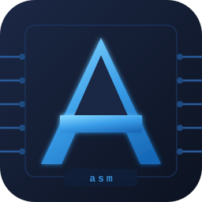
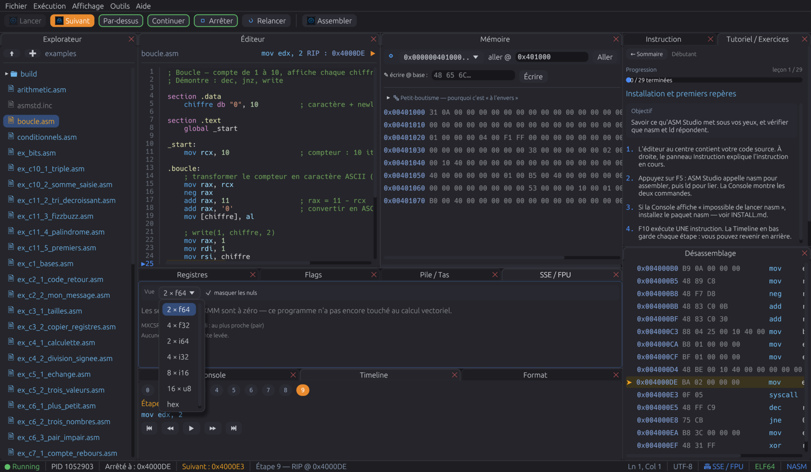
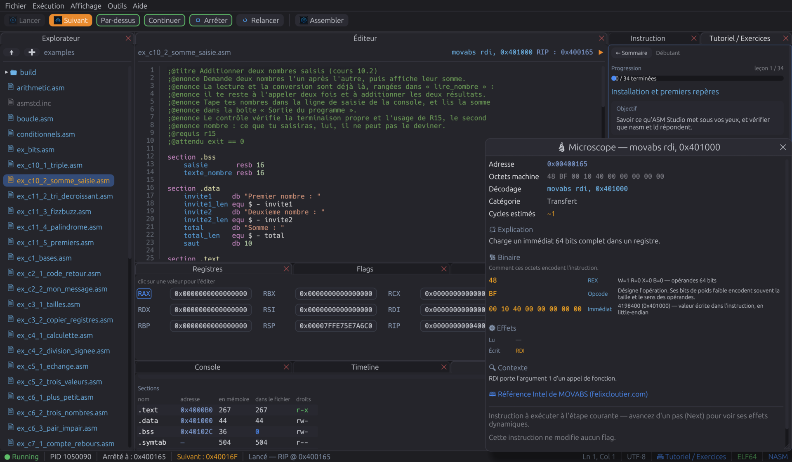

<p align="center">
  
</p>

<h1 align="center">ASM Studio</h1>

<p align="center"><strong>Learn NASM x86-64 by watching a real Linux process execute.</strong></p>

<p align="center">
  <a href="https://github.com/fredza/asm-studio/releases"></a>
  
  <a href="LICENSE.md"></a>
</p>

<p align="center"><strong>English</strong> · <a href="README.fr.md">Français</a> · <a href="README.es.md">Español</a></p>

ASM Studio assembles your source with `nasm`, links it with `ld`, and runs it
under the real Linux kernel. Step through the process with `ptrace` and inspect
its registers, flags, stack and memory as they really are — no CPU simulator in
between.


| Inspect vector registers | Understand one instruction |
|---|---|
|  |  |

---

## Contents

- [Features](#features)
- [Installation](#installation)
- [Quick start](#quick-start)
- [Keyboard shortcuts](#keyboard-shortcuts)
- [Building from source](#building-from-source)
- [Dependencies](#dependencies)
- [Project layout](#project-layout)
- [License](#license)

---

## Features

- **Real debugger** — step-by-step execution of a NASM binary via `ptrace`
  (registers, `SETREGS`, reading/writing `/proc/pid/mem`), not a simulated
  virtual machine.
- **Breakpoints, conditional when needed** — click the gutter (or `Ctrl+F8`) to
  mark a line, then `Continue` (`F9`) runs up to it. Right-click (or
  `Ctrl+Shift+F8`) attaches a condition — `RCX == 0`, `RAX > 0x100`, `ZF == 1`
  — and execution only stops when it holds: enough to reach the four
  thousandth turn of a loop without four thousand “Continue”. `Step over`
  (`Shift+F10`) runs a whole `call` in one go. Every instruction still lands in
  the timeline.
- **Hover inspection** — hovering a word in the code shows what it is worth at
  that moment: a register in hex, decimal, signed decimal, as a character and
  with the bytes it points at; a flag with its state; a label with its line and
  address; a number in all three bases.
- **Real console** — what the program writes to stdout/stderr shows up in the
  IDE, and you can type into its standard input: a program blocked on `read`
  waits for you instead of freezing the interface.
- **Two display modes** — *Learning* (the essentials: code, explained
  instruction, general-purpose registers, stack, console) and *Full*
  (everything: disassembly, memory view, hex dump, call stack, syscalls).
- **Dockable layout** — every panel can be dragged, stacked or detached into
  a floating window (`egui_dock`), like a regular IDE.
- **Guided tutorial** — a five-level path (Beginner, Intermediate, Advanced,
  Expert, and Windows/PE64) that progressively introduces registers, sizes,
  memory, flags, the stack and syscalls. Each lesson loads its program, opens
  the panels it explains, and offers the exercises that practise it.
- **Self-checked exercises** — thirty-six exercises with automatic result
  verification, each linked back to the lesson that explains it.
- **"Live CPU" mode** — modified registers and flags pulse on every step,
  with PUSH/POP activity badges on the stack view.
- **Prediction** — guess the effect of the next instruction before running
  it, to reinforce understanding.
- **SSE / x87 registers** — the sixteen XMM registers and the x87 stack, read
  the way the instruction reads them: two `double`, four `float`, four 32-bit
  integers, sixteen bytes, or raw hex. MXCSR rounding mode and raised
  exceptions included. Writing `addsd xmm0, xmm1` and seeing `5` no longer
  requires a leap of faith.
- **Windows target (PE64)** — the same source can be assembled as a real
  Windows `.exe` (`nasm -f win64` plus a built-in linker: no `lld-link`, no
  Microsoft SDK). `extern ExitProcess` becomes a proper import table. The
  binary disassembles and opens in the FORMAT panel, and — if `wine` is
  installed — `Run` executes it, with its output in the usual console. What
  stays out of reach is single-stepping: the debugger speaks `ptrace` and
  follows the addresses of the image it just wrote, neither of which survives
  Wine's loader.
- **Binary format explorer** — header, sections, permissions, entry point,
  imports and global symbols, shown the same way for ELF and PE. What a
  section costs in memory versus on disk, and why `.bss` weighs nothing.
- **Built-in calculator** — hexadecimal by default, bit-by-bit view, common
  operations.
- **Error diagnostics** — `nasm`/`ld` errors and runtime crashes rephrased
  in plain language.
- **Multilingual** — interface available in French, English and Spanish.
- **Auto-update** — checks for new releases on GitHub.

---

## Installation

### Prebuilt binary

Download the latest archive from the
[GitHub Releases](https://github.com/fredza/asm-studio/releases), then:

```bash
tar xzf asm-studio-*-linux-x86_64.tar.gz
cd asm-studio-*/
./install.sh                  # per-user install, into ~/.local
# or
sudo ./install.sh --system    # system-wide install, into /usr/local
```

The script installs the binary, icon and `.desktop` file, and checks for
`nasm` and `ld`.

### See also

- [`DEPENDENCIES.md`](DEPENDENCIES.md) — the full list of required system
  libraries (Wayland/X11, XDG portal, `nasm`, `binutils`…) and install
  commands per distribution.
- [`doc/GUIDE-DEMARRAGE-RAPIDE.md`](doc/GUIDE-DEMARRAGE-RAPIDE.md) — the
  complete user guide (French only for now): first program, panels,
  shortcuts, troubleshooting.

---

## Quick start

On first launch, ASM Studio creates your working folders, seeds them with
commented examples and exercises, and opens in **Learning mode** with a
banner offering to start the guided tutorial.

A minimal first program (`File → New`, `Ctrl+N`):

```nasm
section .text
    global _start
_start:
    mov rax, 60      ; sys_exit
    xor rdi, rdi     ; exit code 0
    syscall
```

Workflow: **Assemble → Run → Step → Timeline**. Full details in the
[quick start guide](doc/GUIDE-DEMARRAGE-RAPIDE.md) (French).

---

## Keyboard shortcuts

The main ones; `F1` shows the complete list inside the application.

| Key | Action |
|---|---|
| `F1` | Show / hide the shortcut help |
| `Ctrl+B` | Assemble and link |
| `F5` | Run / restart |
| `F10` (or `F8`) | Next instruction |
| `Shift+F10` | Step over: run the call in one go |
| `F9` | Continue to the next breakpoint |
| `Ctrl+F8` | Breakpoint on the cursor's line (or click the gutter) |
| `Ctrl+Shift+F8` | Breakpoint condition (or right-click the gutter) |
| `Esc` (or `Shift+F5`) | Stop the program |
| `←` / `→` | Timeline: previous / next step |
| `Home` / `End` | Timeline: start / end |
| `Ctrl+N` / `Ctrl+O` / `Ctrl+S` | New / Open / Save |
| `Ctrl+F` / `Ctrl+H` | Find / find and replace |
| `Ctrl+Shift+P` | Command palette — the whole app from the keyboard |
| `Ctrl+1` … `Ctrl+5` | Show / hide a panel |
| `F6` / `Shift+F6` | Next / previous panel |

The whole interface is keyboard-drivable: the command palette
(`Ctrl+Shift+P`) reaches every action without going through the menus.

---

## Building from source

Requirements: Rust (2024 edition), `nasm`, `binutils` (`ld`), and the
libraries listed in [`DEPENDENCIES.md`](DEPENDENCIES.md) (Wayland/EGL,
`libxkbcommon`, XDG portal).

```bash
git clone https://github.com/fredza/asm-studio.git
cd asm-studio
cargo build --release
./target/release/asm_studio
```

Build a distribution archive (binary + resources + scripts):

```bash
./install/package.sh
# → dist/asm-studio-<version>-linux-x86_64.tar.gz
```

Run the tests:

```bash
cargo test
```

---

## Dependencies

Platform: **Linux x86-64** only (step-by-step execution relies on `ptrace`).
Main Rust dependencies:

| Crate | Role |
|---|---|
| `eframe` / `egui_dock` | GUI and dockable layout |
| `nix` | `ptrace`, process and signal handling |
| `capstone` | x86-64 disassembly |
| `object` | reading ELF/PE, and writing the PE executable |
| `rfd` | native file dialogs (XDG portal) |
| `ureq` / `serde` | update checking (GitHub Releases) |

External tools required at runtime: `nasm` (assembler) and `ld` (linker).
See [`DEPENDENCIES.md`](DEPENDENCIES.md) for the full breakdown (system
libraries, per-distribution packages, quick checks).

---

## Project layout

```
src/
├── app/            UI (dockable panels, menus, shortcuts, tutorial…)
├── debugger.rs      ptrace-driven control of the debugged process
├── disasm.rs         disassembly (capstone)
├── assemble.rs       invokes nasm / ld (ELF) or nasm / built-in linker (PE)
├── pe_link.rs         PE64 linker: sections, imports, relocations
├── binfmt.rs           binary format explorer (ELF and PE)
├── simd.rs              reading XMM / x87 registers
├── winerun.rs            running the produced .exe under Wine
├── tutorial.rs        guided-path content
├── exercise.rs         self-checked exercises
├── i18n.rs              FR / EN / ES translations
└── main.rs                entry point
examples_seed/      examples and exercises seeded on first launch
install/            install and packaging scripts
doc/                quick start guide (French)
```

---

## License

Distributed under the **ASM Studio Personal Free License (ASFL) v1.0** —
see [`LICENSE.md`](LICENSE.md). In short: free to use, source available and
open to review, contributions via pull request are welcome; selling or
commercially redistributing the software (original or modified) is
prohibited without the author's prior written permission.

Copyright © 2026 Frédéric Zawalski.
